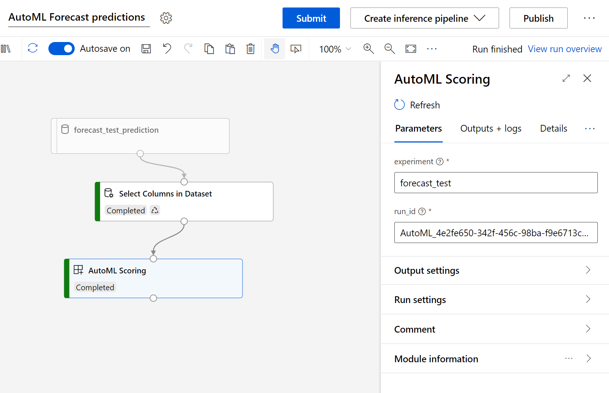

# aml-automl-custom-component

A set of custom components for using AutoML and AutoML Vision in Designer for Batch Scoring. It supports the following AutoML models:

* Classification
* Regression
* Forecasting

For AutoML Vision, it supports:

* Image Classification (using AutoML Vision)
* Object Detection (using AutoML Vision)




## Instructions

1. Import via the `Modules` capability in Azure Machine Learning Studio, point it to:
    * AutoML - `https://github.com/csiebler/aml-automl-custom-component/blob/main/automl_scoring.spec.yaml`
    * AutoML Vision - `https://github.com/csiebler/aml-automl-custom-component/blob/main/automl_vision_scoring.spec.yaml`
1. Then use in Azure Machine Learning Designer
1. Specify our AutoML experiment name, e.g., `automl-credit` and point it to the `run_id` of the model you want to use, e.g. `AutoML_13528b38-bfe2-449e-9b43-967de35ecb3f_0`

## Running locally and testing

First, install the `conda` env needed to run the code locally:

```cli
$ conda env create -f conda.yaml
$ conda activate automl
```

Next, you can run the code against an existing AutoML run:

```cli
$ python automl_scoring.py --input_data ./tests/classification/input-sample --predictions_data ./output --experiment automl-credit --run_id AutoML_13528b38-bfe2-449e-9b43-967de35ecb3f_0
```

You can use the following code to create your input sample from e.g., a `csv` file via:

```python
import os
import pandas as pd
from azureml.studio.core.io.data_frame_directory import load_data_frame_from_directory, save_data_frame_to_directory

df = pd.read_csv('data.csv')
os.makedirs("input-sample", exist_ok=True)
save_data_frame_to_directory("./input-sample", df)
```

Alternatively, you can run the acceptance tests. However, you will first need to update the `experiments` and `run_ids` in [`tests/*.py`](tests/):

```cli
$ pytest
```

## Known limitations

* Only connect input data with the same columns as used during AutoML training
* Scoring is currently not scaled to multiple nodes